# Project's report

## Phân hệ khách

### Giới thiệu ứng dụng, hiển thị meeting mới nhất
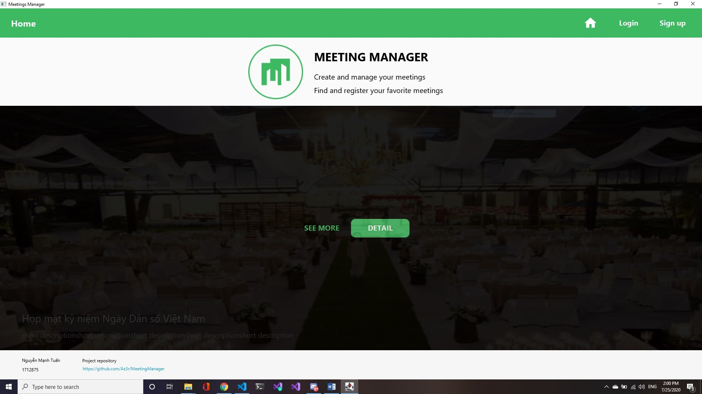

### Danh sách meeting, trình bày danh sách theo hàng
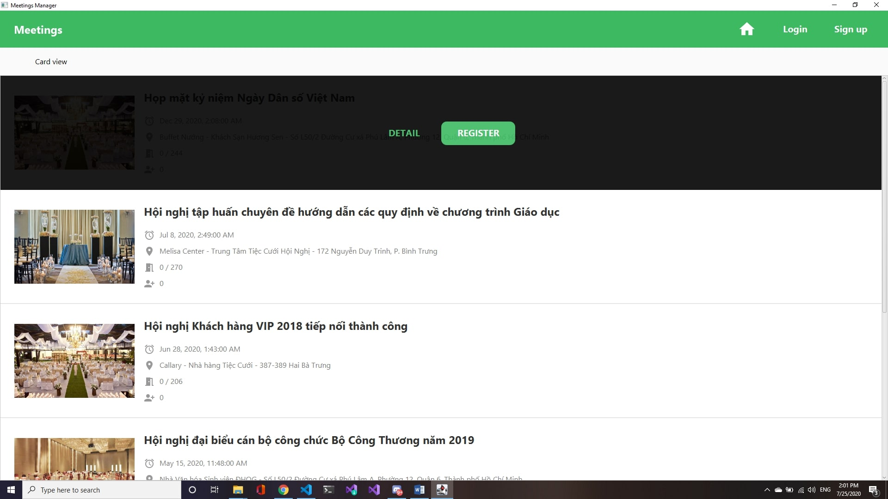

### Danh sách meeting, trình bày danh sách theo dạng thẻ
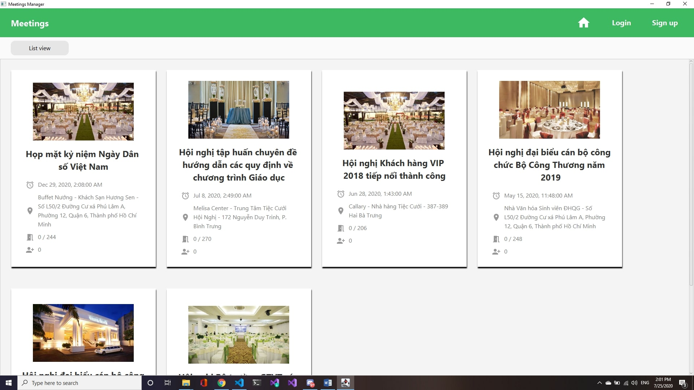

### Màn hình chi tiết hội nghị
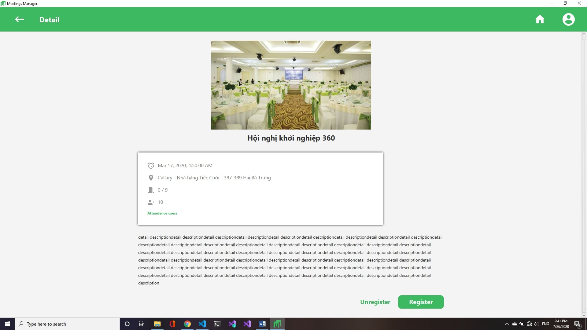

### Dialog đăng kí đăng nhập
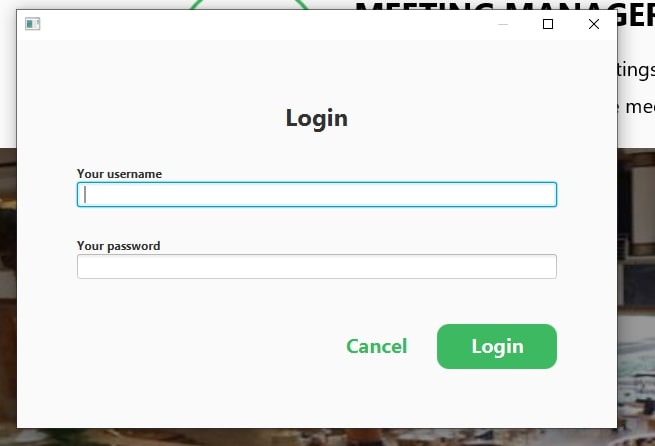

#### Màn hình báo không cho phép đăng kí khi số lượng đã đủ

## Phân hệ Thành viên (người dùng đã tạo tài khoản)

### Appbar khi chưa đăng nhập

### Appbar khi đã đăng nhập

### Màn hình tài khoản
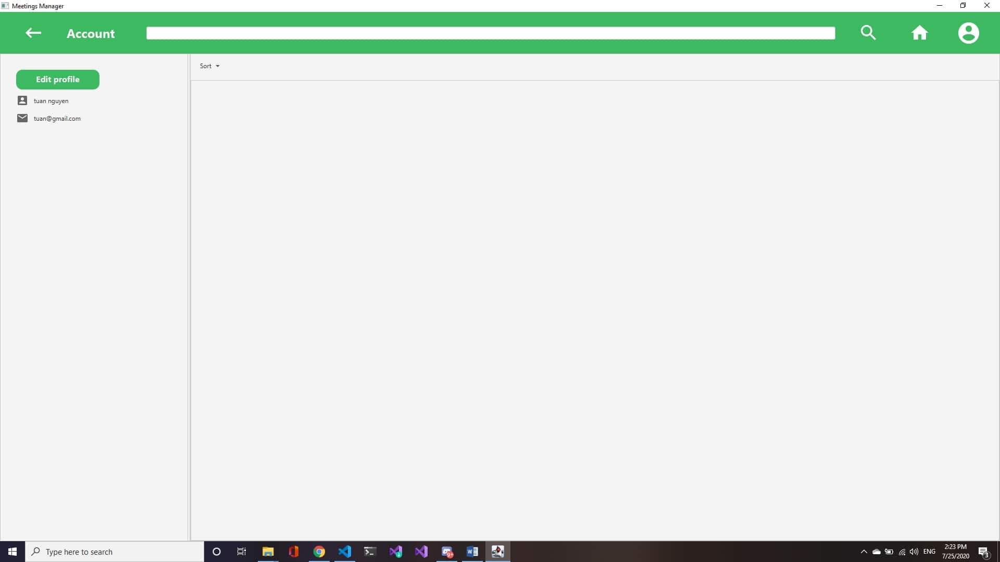

### Màn hình chỉnh sửa tài khoản
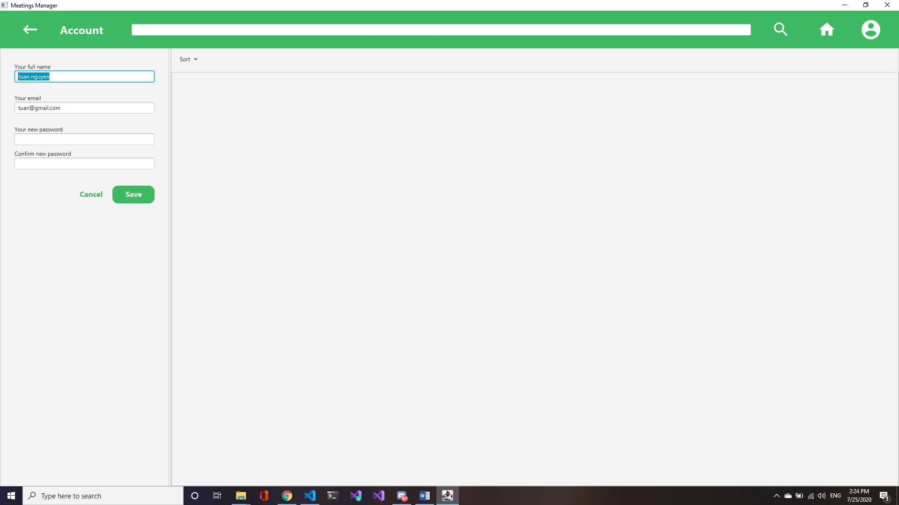

### Xem chi tiết hoặc hủy tham sự

### Chọn hủy tham dự hội nghị
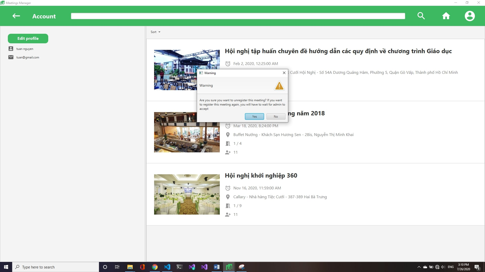

### Sau khi hủy đăng kí
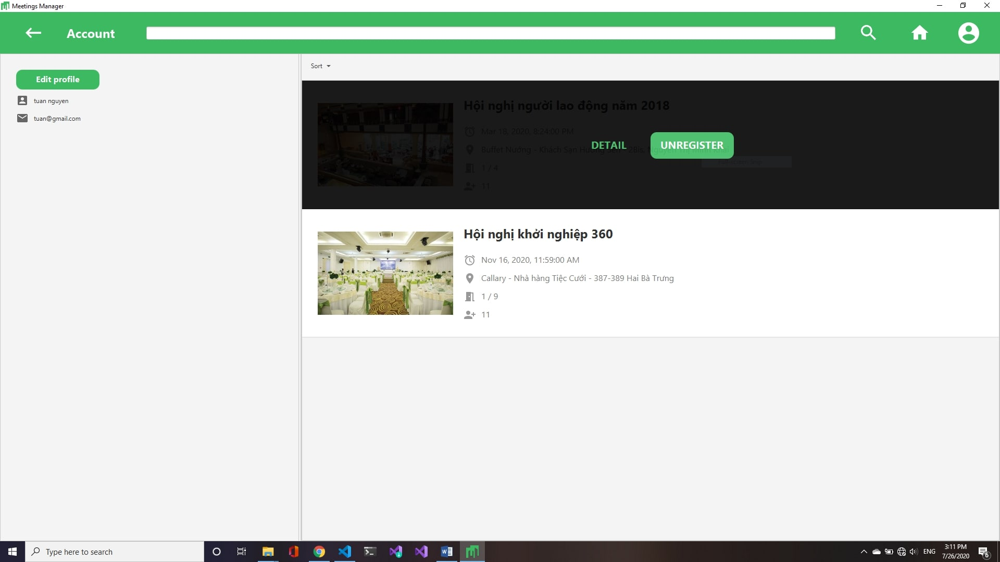

## Phân hệ Admin

### Topbar khi đăng nhập bằng tài khoản Admin

### Màn hình xem danh sách hội nghị đã tạo
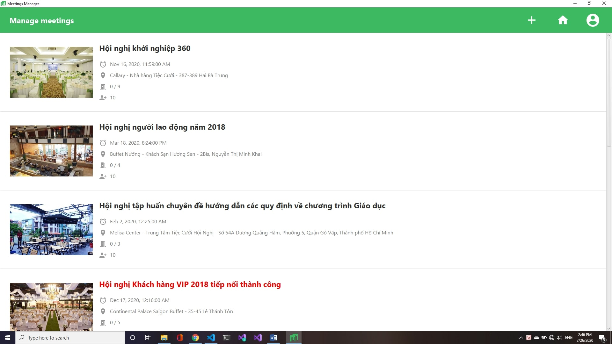

### Màn hình thêm mới hội nghị (Khi bấm vào dấu '+' trên topbar)

### Màn hình sửa đổi hội nghị
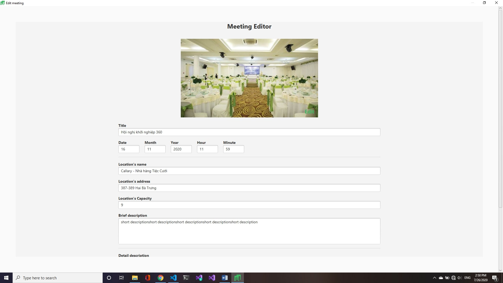

### Danh sách yêu cầu tham dự của 1 hội nghị
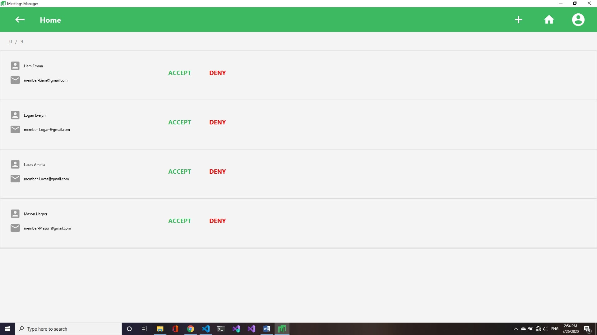

### Danh sách User
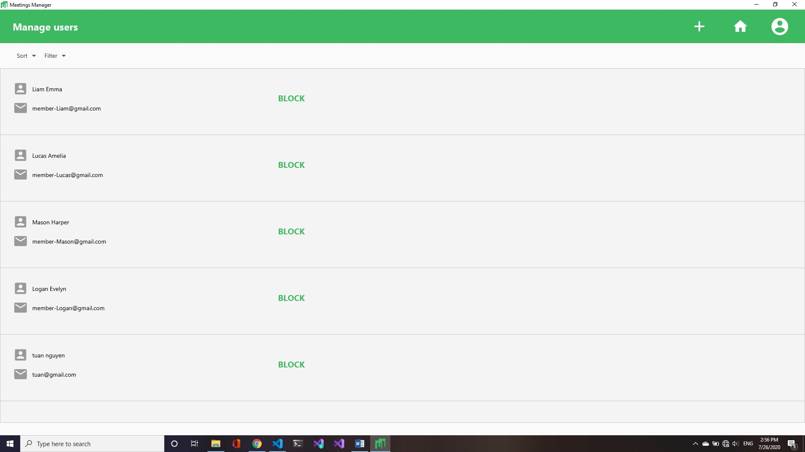

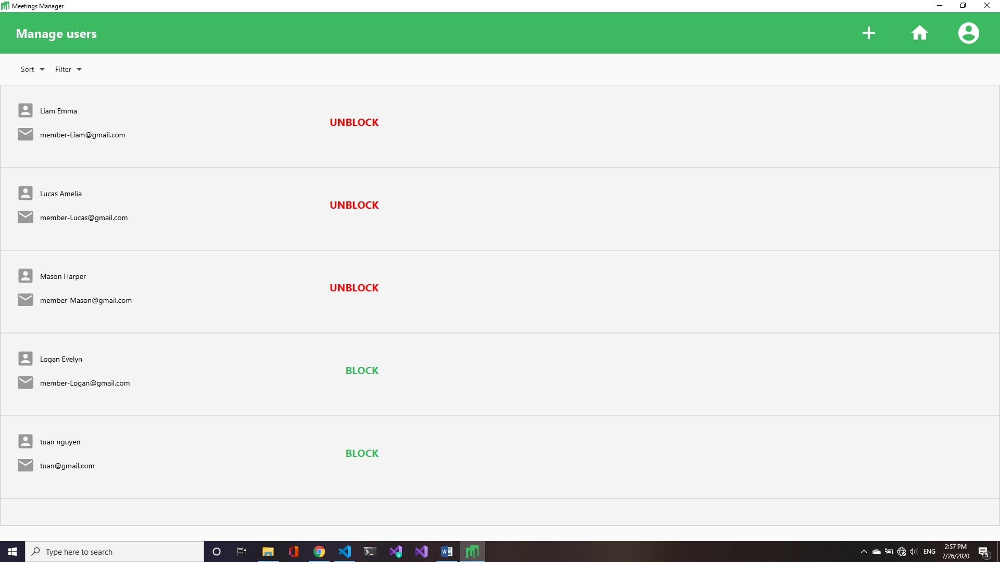

### Lọc, sắp sếp User
#### Lọc các user không bị chặn
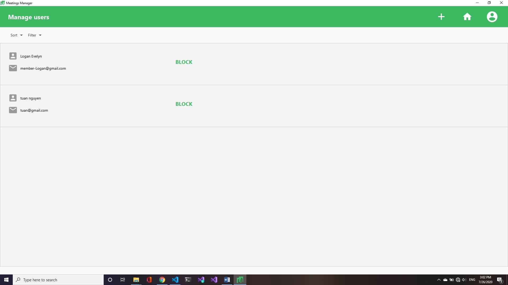

#### Lọc các user đã bị chặn

#### Sắp xếp user theo tên A-Z

#### Sắp xếp user theo email Z-A
