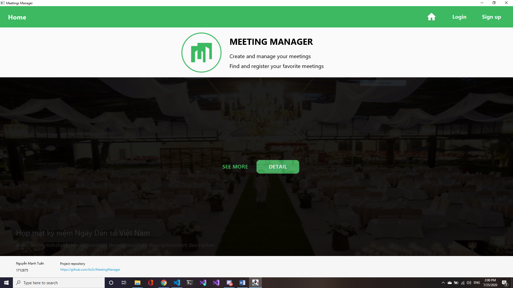

# Project's report

## Phân hệ khách

### Giới thiệu ứng dụng, hiển thị meeting mới nhất

### Danh sách meeting, trình bày danh sách theo hàng

### Danh sách meeting, trình bày danh sách theo dạng thẻ

### Màn hình chi tiết hội nghị

### Dialog đăng kí đăng nhập

#### Màn hình báo không cho phép đăng kí khi số lượng đã đủ

## Phân hệ Thành viên (người dùng đã tạo tài khoản)

### Appbar khi chưa đăng nhập

### Appbar khi đã đăng nhập

### Màn hình tài khoản

### Màn hình chỉnh sửa tài khoản

### Xem chi tiết hoặc hủy tham sự

### Chọn hủy tham dự hội nghị

### Sau khi hủy đăng kí

## Phân hệ Admin

### Topbar khi đăng nhập bằng tài khoản Admin

### Màn hình xem danh sách hội nghị đã tạo

### Màn hình thêm mới hội nghị (Khi bấm vào dấu '+' trên topbar)

### Màn hình sửa đổi hội nghị

### Danh sách yêu cầu tham dự của 1 hội nghị

### Danh sách User

### Lọc, sắp sếp User
Lọc các user không bị chặn

Lọc các user đã bị chặn

Sắp xếp user theo tên A-Z

Sắp xếp user theo email Z-A
